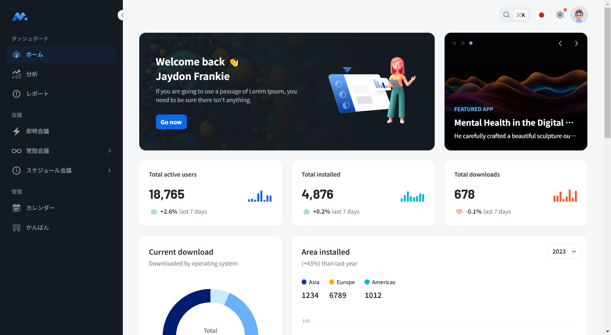
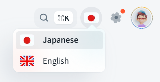
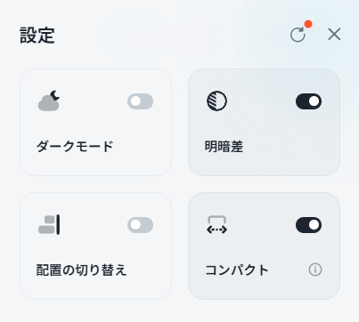
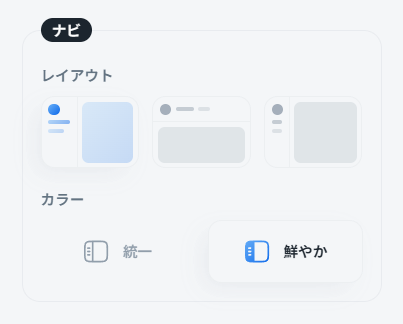
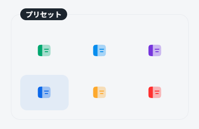
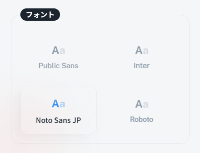
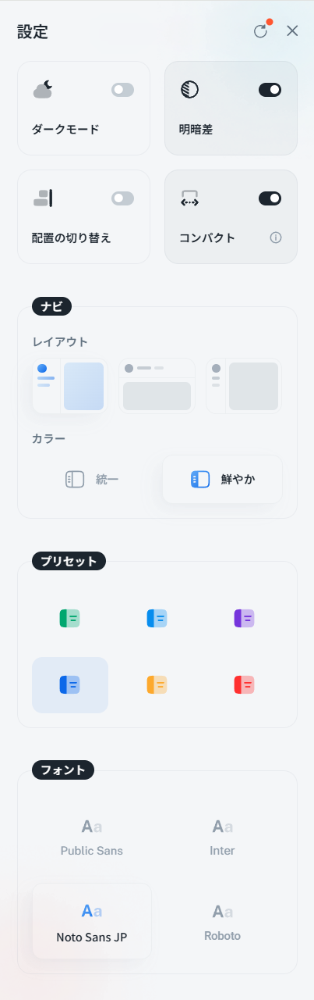
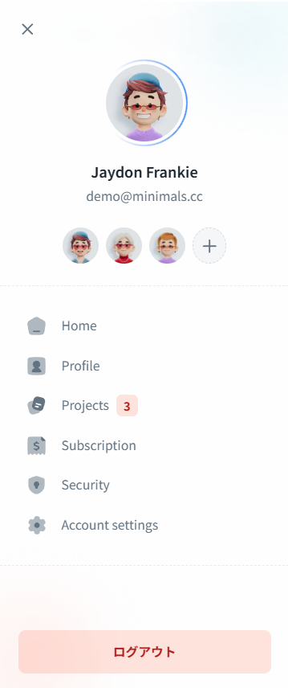

# はじめに

本ドキュメントは、個人開発によるWeb会議システムのテンプレートについて説明したものです。

このWeb会議システムは、ローカル環境での概念実証（PoC）を経て開発された、カスタマイズ可能なテンプレートです。標準的な機能を搭載しつつ、ユーザーが独自のニーズに合わせて拡張や改修を行いやすい構造を持っています。

## 特徴

- **柔軟性**

    UIや機能を限定的かつモジュール化された形で提供し、カスタマイズの自由度を高めています。

- **検証済み**

    ローカル環境での動作検証を完了しており、基本的な機能の信頼性を確保しています。

- **拡張性**

    標準機能をベースに、独自の機能追加や統合が容易に行えます。

## 想定される用途

- スタートアップや中小企業向けのカスタムWeb会議ソリューション開発
- 既存システムへのWeb会議機能の統合
- 教育機関や非営利団体向けの特殊なニーズに対応したWeb会議システムの構築

本テンプレートは、Web会議システムの開発時間とコストを大幅に削減しつつ、高度なカスタマイズを可能にします。独自のWeb会議ソリューションを検討されている方々にとって、理想的な出発点になるかもしれません。

詳細な機能や技術仕様、カスタマイズ方法については、以降のページでご説明いたします。

## システム概要

本システムは、時雨堂社のWebRTC製品である[Sora](https://sora.shiguredo.jp/)と連携して動作することを想定した設計となっています。開発段階では、検証目的に限り無料で使える[Sora Labo](https://sora-labo.shiguredo.app/)というサービスを使用し、ローカル環境での疎通確認を行っています。

デザインフレームワークには、MUIの有料テンプレートである[Minimal UI](https://mui.com/store/items/minimal-dashboard/)（v6.0.1）を採用し、モダンで使いやすいインターフェースを実現しています。

以下は、本Web会議システムのトップ画面（ダッシュボード）です

{.image-border}

### ダッシュボード画面の構成

!!!info "サイドバー（左側）"
    Web会議システムの主要機能に合わせてカスタマイズしています。

    - ダッシュボード、分析、レポートなどの主要機能へのナビゲーション
    - 会議関連機能（即時会議、常設会議、スケジュール会議）へのクイックアクセス
    - 管理機能（カレンダー、かんばん）へのリンク

!!!info "メイン領域（中央）"
    表示されている内容は、Minimal UIのデモ内容です。実際の使用時にはWeb会議システム特有の指標やグラフに置き換えることが可能です。以下は使用例です。

    - リアルタイム会議統計
        - Soraの[統計API](https://sora-doc.shiguredo.jp/EXPERIMENTAL_API_STATS#dacb9c)を定期的に実行して、利用ユーザーの統計をグラフ化
    - スケジュール管理
        - 今日／今週の予定会議数
        - 直近の会議予定リスト

!!!info "ヘッダー（上部）"
    プロフィール管理や多言語対応などの機能へのクイックアクセスを配置しています。

    - 検索機能
    - 言語の切り替え
    - 設定機能
    - プロフィール

## システム構成

SPAとして構成されるシステムであり、以下の技術スタックを採用しています。

- フロントエンド: `React + TypeScript`
- バックエンド: `Python + FastAPI`
- データベース: `PostgleSQL`
- 認証方式: `JWT`

### アーキテクチャ

ローカル上で動作させた時のアーキテクチャは以下のとおりです。

### フロントエンドの構成

使用している技術スタックや代表的なパッケージは以下のとおりです

名称 | 説明
-----|-------------------
 `Vite` | 高速な開発環境を提供するビルドツール
 `React` | コンポーネントベースのUIを構築するためのライブラリ
 `TypeScript` | 型安全なJavaScriptのスーパーセット
 `pnpm` | 効率的なパッケージ管理ツール
 `@mui/material` | UIコンポーネントライブラリ
 `Jotai` | 状態管理ライブラリ
 `React Router` | ルーティングライブラリ
 `axios` | HTTPクライアント
 `Vitest` | テストフレームワーク
 `ESLint` | コードリントツール
 `Prettier` | コードフォーマッタ
 `react-i18next` | 国際化フレームワーク
 `sora-js-sdk` | 時雨堂社のWebRTC製品Soraとの連携を可能にするSDK

### バックエンドの構成

使用している技術スタックや代表的なパッケージは以下のとおりです

名称 | 説明
-----|-------------------
 `Rye` | パッケージ管理と仮想環境の管理を行うツール
 `FastAPI` | 高性能なAPIを構築するためのPythonフレームワーク
 `Uvicorn` | ASGIサーバーで、FastAPIと共に使用されます
 `SQLAlchemy` | SQLツールキットとオブジェクトリレーショナルマッパー（ORM）
 `Alembic` | SQLAlchemyのデータベースマイグレーションツール
 `pyjwt` | JSON Webトークンのエンコードとデコードを行うライブラリ
 `psycopg2-binary` | PostgreSQLデータベースアダプタで、PythonからPostgreSQLに接続するためのもの

### 多言語対応

Minimalテンプレートでは`react-i18next`による多言語に対応する仕組みがあります。

画面のヘッダ領域の国旗アイコンが現在使用されている言語を表していますが、テンプレート標準では日本語に対応していません。

本システムでは英語と日本語に対応する形で改修し、自由に切り替えられるようにしています。

### 設定機能

ヘッダ領域の歯車アイコンを押下すると、設定ダイアログが表示されます。

=== "基本"
    
    {.w-40}

=== "ナビ"
    
    {.w-40}

=== "プリセット"
    
    {.w-40}

=== "フォント"
    
    {.w-40}

=== "全体図"
    
    {.w-40}

デフォルトからの対応内容は以下のとおりです。

- 日本語に翻訳
- デフォルトのフォント2種の代わりに日本語対応したフォントを2種追加
    - `DM Sans` → `Noto Sans JP`
    - `Nunito Sans` → `Roboto`

### プロフィール

ヘッダ領域のアバター（顔）アイコンを押下すると、プロフィールのダイアログが表示されます。

表示内容はテンプレートのデモ内容のままですが、ログアウトのボタンだけ日本語化しています。

{.w-40 .image-border}

## 今後の展望

本システムは、当初、複数人による円滑なオンラインコミュニケーションを実現することを主目標として開発に着手しました。現時点で基本的なUIと核となる機能を実装し、実用的なWeb会議システムの基盤を構築できました。しかし、さらなる機能拡張と改善の余地が大いにあります。

開発の透明性と継続的な改善を重視し、現段階での成果を本ドキュメントとして公開することにしました。

今後の計画

1. **ユーザビリティの向上**

    より直感的で使いやすいインターフェースの開発

2. **セキュリティ強化**

    エンドツーエンド暗号化などの高度なセキュリティ機能の実装

3. **協働機能の拡充**

    画面共有やホワイトボード／ドキュメントの共同編集機能の追加

4. **モバイル対応**

    スマートフォンやタブレットに最適化されたアプリケーションの開発

5. **AI統合**

    会議の自動議事録作成、リアルタイム翻訳機能の実装

これらの機能強化と並行して、本ドキュメントも継続的に更新し、最新の情報を提供してまいります。
